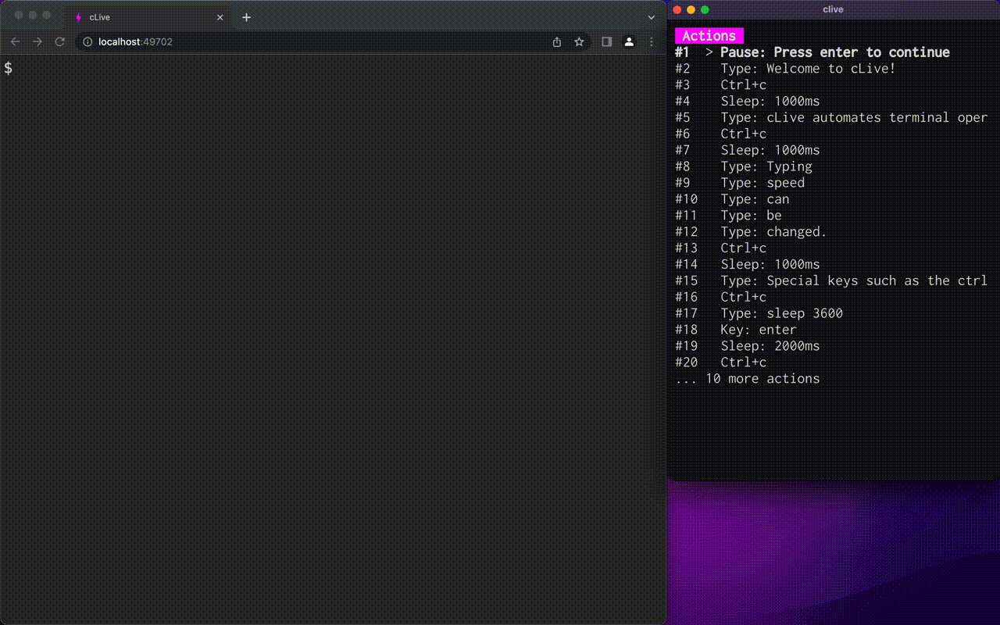

<p align='center'>


</p>

<p align="center">
Automates terminal operations.
</p>

<p align='center'>
<a href="https://github.com/koki-develop/clive/releases/latest"></a>
<a href="https://github.com/koki-develop/clive/releases/latest"></a>
<a href="./LICENSE"></a>
<a href="https://github.com/koki-develop/clive/actions/workflows/ci.yml"></a>
<a href="https://goreportcard.com/report/github.com/koki-develop/clive"></a>
<a href="https://codecov.io/github/koki-develop/clive"></a>
</p>



# cLive

- [Prerequisite](#information_source-prerequisite)
- [Installation](#zap-installation)
- [Getting Started](#beginner-getting-started)
- [Commands](#rocket-commands)
  - [`init`](#clive-init)
  - [`start`](#clive-start)
  - [`validate`](#clive-validate)
  - [`completion`](#clive-completion)
- [Configuration](#gear-configuration)
  - [`actions`](#actions)
  - [`settings`](#settings)
- [Examples](#book-examples)
- [License](#memo-license)

## :information_source: Prerequisite

cLive requires [ttyd](https://tsl0922.github.io/ttyd/) (version `1.7.4` or higher) to be installed.  
For example, if you are using homebrew, you can install it with `brew install`.

```sh
$ brew install ttyd
```

See the [ttyd documentation](https://github.com/tsl0922/ttyd#installation) for more information.

## :zap: Installation

> [!NOTE]
> There are prerequisites for using cLive. See [`Prerequisite`](#information_source-prerequisite) for details.

### Homebrew

```sh
$ brew install clive
```

### Homebrew Tap

```sh
$ brew install koki-develop/tap/clive
```

### `go install`

```sh
$ go install github.com/koki-develop/clive@latest
```

### Releases

Download the binary from the [releases page](https://github.com/koki-develop/clive/releases/latest).

## :beginner: Getting Started

First, run `clive init`.

```sh
$ clive init
Created ./clive.yml
```

A file named `clive.yml` will then be created with the following contents:

```yaml
# documentation: https://github.com/koki-develop/clive#settings
settings:
  loginCommand: ["bash", "--login"]
  fontSize: 22
  defaultSpeed: 10

# documentation: https://github.com/koki-develop/clive#actions
actions:
  - pause
  - type: echo 'Welcome to cLive!'
  - key: enter
```

Finally, run `clive start` to launch the browser and start cLive.

```sh
$ clive start
```

## :rocket: Commands

Available commands:

- [`init`](#clive-init) - Create a config file.
- [`start`](#clive-start) - Start cLive actions.
- [`validate`](#clive-validate) - Validate a config file.
- [`completion`](#clive-completion) - Generate the autocompletion script for the specified shell.

### `clive init`

Create a config file.

```sh
$ clive init
```

| Flag             | Default       | Description       |
| ---------------- | ------------- | ----------------- |
| `-c`, `--config` | `./clive.yml` | Config file name. |

### `clive start`

Start cLive actions.
See [`Configuration`](#gear-configuration) for the config file.

```sh
$ clive start
```

| Flag             | Default       | Description       |
| ---------------- | ------------- | ----------------- |
| `-c`, `--config` | `./clive.yml` | Config file name. |

### `clive validate`

Validate a config file.

```sh
$ clive validate
```

| Flag             | Default       | Description       |
| ---------------- | ------------- | ----------------- |
| `-c`, `--config` | `./clive.yml` | Config file name. |

### `clive completion`

Generate the autocompletion script for clive for the specified shell.  
See each sub-command's help for details on how to use the generated script.

```sh
$ clive completion <shell>

# e.g.
$ clive completion bash
$ clive completion bash --help
```

Available shells:

- bash
- fish
- powershell
- zsh

## :gear: Configuration

The config file consists of `actions` and `settings`.

- [`actions`](#actions) - Actions to run.
- [`settings`](#settings) - Basic settings (font size, default speed, etc.) .

### `actions`

Actions to run.  
Available actions:

- [`type`](#type) - Type characters.
- [`key`](#key) - Enter special keys.
- [`ctrl`](#ctrl) - Press the Ctrl key with other keys.
- [`sleep`](#sleep) - Sleep for a specified number of milliseconds.
- [`pause`](#pause) - Pause actions.
- [`screenshot`](#screenshot) - Take a screenshot.

#### `type`

Type characters.

| Field   | Required | Default | Description                                 |
| ------- | -------- | ------- | ------------------------------------------- |
| `type`  | **Yes**  | N/A     | Characters to type.                         |
| `count` | No       | `1`     | Number of times to repeat the action.       |
| `speed` | No       | `10`    | Interval between key typing (milliseconds). |

```yaml
# e.g.
actions:
  - type: echo 'Hello World'
    count: 10 # Optional
    speed: 100 # Optional
```

#### `key`

Enter special keys.  
Available keys:

- `esc`
- `backspace`
- `tab`
- `enter`
- `left`
- `up`
- `right`
- `down`
- `space`

| Field   | Required | Default | Description                                 |
| ------- | -------- | ------- | ------------------------------------------- |
| `key`   | **Yes**  | N/A     | Special key to type.                        |
| `count` | No       | `1`     | Number of times to repeat the action.       |
| `speed` | No       | `10`    | Interval between key typing (milliseconds). |

```yaml
# e.g.
actions:
  - key: enter
    count: 10 # Optional
    speed: 100 # Optional
```

#### `ctrl`

Press the Ctrl key with other keys.

| Field   | Required | Default | Description                                 |
| ------- | -------- | ------- | ------------------------------------------- |
| `ctrl`  | **Yes**  | N/A     | Characters to enter with the ctrl key.      |
| `count` | No       | `1`     | Number of times to repeat the action.       |
| `speed` | No       | `10`    | Interval between key typing (milliseconds). |

```yaml
# e.g.
actions:
  - ctrl: c # Ctrl+c
    count: 10 # Optional
    speed: 100 # Optional
```

#### `sleep`

Sleep for a specified number of milliseconds.

| Field   | Required | Default | Description                   |
| ------- | -------- | ------- | ----------------------------- |
| `sleep` | **Yes**  | N/A     | Time to sleep (milliseconds). |

```yaml
# e.g.
actions:
  - sleep: 3000 # Sleep for 3 seconds.
```

#### `pause`

Pause actions.  
Press enter to continue.

```yaml
# e.g.
actions:
  - pause
```

#### `screenshot`

Take a screenshot.  
Screenshots are saved in `screenshots/`.  
The directory to save the screenshots can be changed in [`settings.screenshotsDir`](#screenshotsdir).

| Field        | Required | Default                               | Description                  |
| ------------ | -------- | ------------------------------------- | ---------------------------- |
| `screenshot` | No       | `<ACTION_INDEX>_<yyyymmddHHMMSS>.png` | File name of the screenshot. |

```yaml
# e.g.
actions:
  - screenshot
  - screenshot: foobar.png # Optional
```

### `settings`

Basic settings.  
Available settings:

- [`loginCommand`](#logincommand) - Login command and args.
- [`fontSize`](#fontsize) - Font size.
- [`fontFamily`](#fontfamily) - Font family.
- [`defaultSpeed`](#defaultspeed) - Default interval between key typing.
- [`skipPauseBeforeQuit`](#skippausebeforequit) - Whether to skip pausing before quitting.
- [`screenshotsDir`](#screenshotsdir) - Directory to save screenshots.
- [`browserBin`](#browserbin) - Path to an executable browser binary.
- [`headless`](#headless) - Whether to run the browser in headless mode.
- [`width`](#width) - Window width.
- [`height`](#height) - Window height.

#### `loginCommand`

Login command and args.  
Default: `["bash", "--login"]`.

```yaml
# e.g.
settings:
  loginCommand: ["zsh", "--login"]
```

#### `fontSize`

Font size.  
Default: `22`

```yaml
# e.g.
settings:
  fontSize: 36
```

#### `fontFamily`

Font family.

```yaml
# e.g.
settings:
  fontFamily: monospace
```

#### `defaultSpeed`

Default interval between key typing.  
Default: `10`

```yaml
# e.g.
settings:
  defaultSpeed: 100
```

#### `skipPauseBeforeQuit`

Whether to skip pausing before quitting.  
Default: `false`

```yaml
# e.g.
settings:
  skipPauseBeforeQuit: true
```

#### `screenshotsDir`

Directory to save screenshots.  
Default: `screenshots`

```yaml
# e.g.
settings:
  screenshotsDir: path/to/pictures
```

#### `browserBin`

Path to an executable browser binary.  
See the [go-rod documentation](https://github.com/go-rod/go-rod.github.io/blob/master/compatibility.md#supported-browsers) for supported browsers.

```yaml
# e.g.
settings:
  browserBin: /Applications/Sidekick.app/Contents/MacOS/Sidekick # use Sidekick
```

#### `headless`

Whether to run the browser in headless mode.  
Default: `false`

```yaml
# e.g.
settings:
  headless: true
```

#### `width`

Window width.

```yaml
# e.g.
settings:
  width: 1600
```

#### `height`

Window height.

```yaml
# e.g.
settings:
  height: 800
```

## :book: Examples

For more examples see the [`examples/`](./examples/) directory.

## :coffee: Buy me a coffee

If you like this project, please consider buying me a coffee.

<a href="https://www.buymeacoffee.com/koki.sato"></a>

## :memo: License

[MIT License](./LICENSE)
